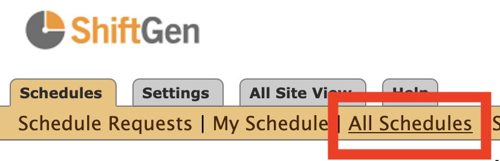
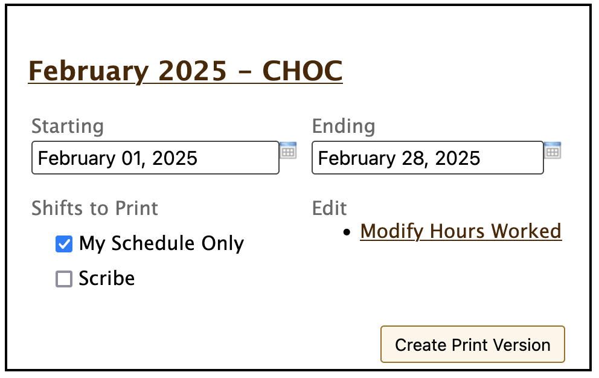

# shiftgen-calendar
Chrome extension to export shifts from ShiftGen to Google Calendar

## Usage
1. Login to [https://shiftgen.com](https://shiftgen.com) and navigate to `Schedules > All Schedules`

2. For the month you want to create events for, select `My Schedule Only` under `Shifts to Print`, then click `Create Print Version`

3. In the extension popup, click `Scrape My Schedule`
