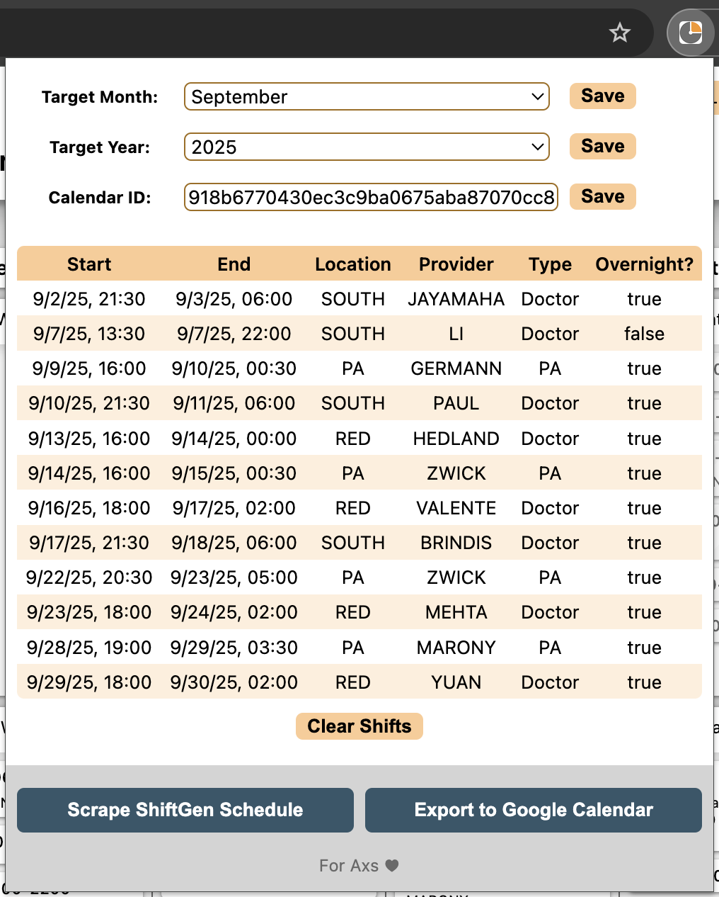

# ShiftGen Schedule Exporter
Chrome extension to assist medical staff in exporting schedule with extra information about the provider on staff from ShiftGen to Google Calendar.

## Installation
Since this Chrome extension is still in development, users must install this extension through the extension developer mode by cloning the repository and loading the unpacked extension in [chrome://extensions/](chrome://extensions/). Current implementation with the Google Calendar API is currently limited to test users.

## Usage

To use this extension, first open the extension's popup and configure the settings.

* Target Month: The month to be processed
* Target Year: The year to be processed
* Calendar ID: The Google Calendar ID where the processed shifts will be exported to. To find this value, navigate to the settings page of your Google Calendar, navigate to the "Integrate calendar" subsection, and copy "Calendar ID" value into the extension popup.

  

After the settings have been configured, login to [https://shiftgen.com](https://shiftgen.com) and click "Scrape ShiftGen Schedule" to gather all shift data and provider information. This process will open new tabs in your browser as the extension navigates to different pages within ShiftGen. When you get a notification saying "Completed scraping shifts" the processing is complete and you may close any open ShiftGen tabs. 

  

Open the extension popup to examine the processed shift data. To export the data to Google Calendar, simply click the "Export to Google Calendar" button.

  

## Workflow

  

